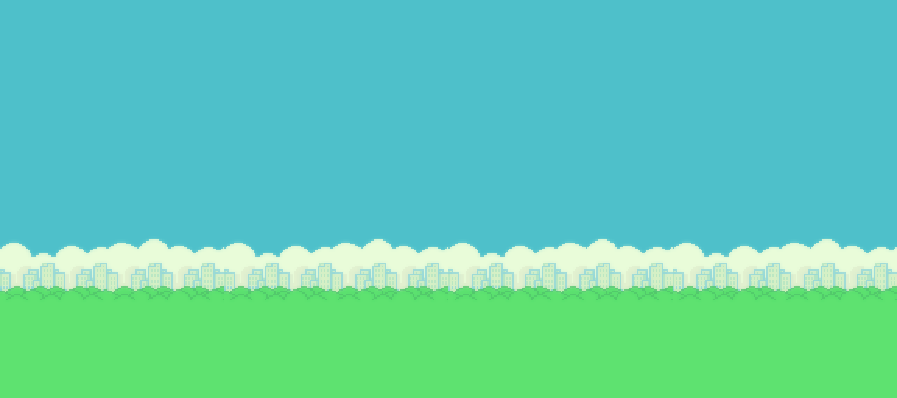

# Flappy Bird

libGDX와 Java로 제작한 데스크톱용 Flappy Bird 스타일 게임입니다. 기본 Flappy Bird 게임플레이에 스테이지별 이동 파이프와 적, 빔 공격 요소를 추가했습니다.

## PROJECT 개요

- **프레임워크:** [libGDX 1.13.1](https://libgdx.com/)
- **데스크톱 백엔드:** LWJGL3
- **언어:** Java 8 호환 코드
- **빌드 도구:** Gradle Wrapper
- **지원 플랫폼:** Windows x64, macOS Apple Silicon, Linux x64
- **주요 모듈:**
	- `core`: 게임 규칙, 화면 렌더링, 입력 처리, 게임 오브젝트
	- `lwjgl3`: 데스크톱 실행 런처와 플랫폼별 패키징 설정

## 파일 구조

```text
FlappyBird-master/
├── assets/                         # 게임 이미지, 사운드 등 리소스
│   ├── Sounds/
│   └── Sprite/
├── core/
│   └── src/main/java/io/github/some_example_name/
│       ├── Main.java               # 메인 게임 로직
│       ├── GameWorld.java          # 스테이지, 점수, 충돌, 파이프 관리
│       ├── Bird.java               # 플레이어 캐릭터
│       ├── PairPipe.java            # 파이프 장애물
│       ├── Enemy.java               # 스테이지 3 적
│       └── Beam.java                # 스테이지 3 빔 공격
├── lwjgl3/
│   └── src/main/java/.../lwjgl3/
│       └── Lwjgl3Launcher.java      # 데스크톱 실행 진입점
├── build.gradle                     # 공통 Gradle 설정
├── settings.gradle                  # Gradle 모듈 설정
├── gradlew                          # macOS/Linux용 Gradle Wrapper
└── gradlew.bat                      # Windows용 Gradle Wrapper
```

## 실행 방법

명령은 프로젝트 루트(`FlappyBird-master`)에서 실행합니다.

### Windows

Windows에서 개발 실행:

```bat
gradlew.bat lwjgl3:run
```

Windows용 실행 파일 빌드:

```bat
gradlew.bat lwjgl3:packageWinX64
```

생성된 `lwjgl3/build/construo/dist/ㄹFlappy Bird-winX64.zip`을 Windows로 옮긴 후 압축을 해제합니다. 압축 해제한 폴더 안의 `ㄹFlappy Bird.exe`를 실행합니다. EXE 파일만 따로 옮기지 말고 ZIP 전체를 사용해야 합니다.

### macOS

처음 한 번만 Gradle Wrapper에 실행 권한을 부여합니다.

```bash
chmod +x ./gradlew
```

개발 실행:

```bash
./gradlew lwjgl3:run
```

Apple Silicon용 macOS 앱 빌드:

```bash
./gradlew lwjgl3:buildMacAppBundleMacM1
```

생성된 앱 실행:

```bash
open "lwjgl3/build/construo/macM1/ㄹFlappy Bird.app"
```

macOS 배포용 ZIP이 필요하면 다음 명령을 사용합니다.

```bash
./gradlew lwjgl3:packageMacM1
```

## 게임 설명

### 스테이지

모든 스테이지는 목표 점수에 도달하면 다음 스테이지로 넘어갑니다.

1. **Stage 1:** 기본 초록색 파이프를 통과합니다.
2. **Stage 2:** 일부 파이프가 위아래로 움직이며, 빨간색 파이프가 등장합니다.
3. **Stage 3:** 움직이는 파이프와 적이 추가됩니다. `Space` 키로 빔을 발사할 수 있습니다.

Stage 3를 클리어하면 게임이 종료 화면으로 전환됩니다. 장애물이나 적에 부딪히면 실패하며, `Esc` 키로 처음부터 다시 시작할 수 있습니다.

### 조작키

| 입력 | 동작 |
| --- | --- |
| 마우스 클릭 또는 화면 터치 | 게임 시작 / 새 점프 |
| `Space` | Stage 3에서 빔 발사 |
| `Esc` | 게임 중 일시정지 및 재개 |
| `Esc` | 실패 또는 클리어 화면에서 Stage 1부터 재시작 |

### 예시 화면

게임에 사용되는 주요 화면 리소스입니다.

| 플레이 화면 요소 | 실패 화면 | 클리어 화면 |
| --- | --- | --- |
|  |  |  |

실행 중에는 화면 상단에 현재 점수, 목표 점수, 스테이지가 표시됩니다. Stage 3에서는 화면 하단에 `SPACE TO SHOOT` 안내가 표시됩니다.

## 빌드 산출물

- `lwjgl3/build/libs/`: 실행 가능한 JAR
- `lwjgl3/build/construo/macM1/`: macOS 앱 번들
- `lwjgl3/build/construo/dist/`: macOS 및 Windows 배포 ZIP
